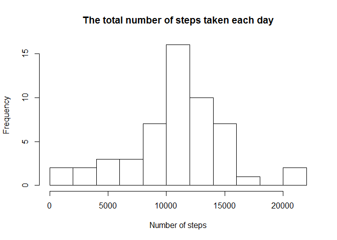
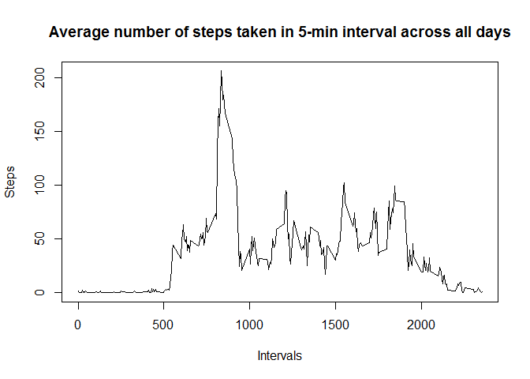
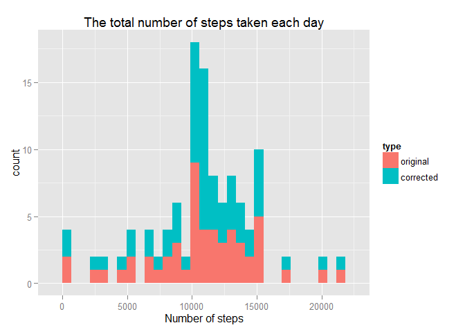
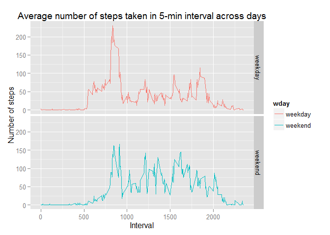

# Reproducible Research: Peer Assessment 1
written by Gennady Khvorykh  
June 14, 2015  

## Loading and preprocessing the data

The dataset for this assignment was downloaded from the course website: [аctivity monitoring data](https://d396qusza40orc.cloudfront.net/repdata%2Fdata%2Factivity.zip). Code below downloads zipped file with dataset and unzips it. 


```r
download.file("https://d396qusza40orc.cloudfront.net/repdata%2Fdata%2Factivity.zip",
              "activity.zip", mode = "wb")
unzip("activity.zip")
```

The following code loads the file `activity.csv` into R program environment. 


```r
data <- read.table("activity.csv", header = T, sep = ",", 
                   stringsAsFactor = F, 
                   colClasses = c("integer", "character", "integer")) 
```

The dataset showed **17568 observations** with 3 variables: `steps`, `date`, and `interval`.

```r
head(data, 5)
```

```
##   steps       date interval
## 1    NA 2012-10-01        0
## 2    NA 2012-10-01        5
## 3    NA 2012-10-01       10
## 4    NA 2012-10-01       15
## 5    NA 2012-10-01       20
```


Since `Date` format will be required further for manipulation with dates, the column with dates was converted into such format.


```r
data$date <- as.Date(data$date, "%Y-%m-%d") 
```

To run the calculations below, `ddply` function from `plyr` package was used. To plot the data, `ggplot` graphical system was applied. These packages should be prior initialized. 


```r
lib <- c("plyr", "ggplot2")
sapply(lib, require, character.only = T) 
```

```
## Loading required package: plyr
## Loading required package: ggplot2
```

```
##    plyr ggplot2 
##    TRUE    TRUE
```

## What is mean total number of steps taken per day?

The mean of the total number of steps taken per day was calculated resulting in `steps.daily` data frame with **61 observations**. 


```r
steps.daily <- ddply(data, .(date), summarize, value = sum(steps))

head(steps.daily)
```

```
##         date value
## 1 2012-10-01    NA
## 2 2012-10-02   126
## 3 2012-10-03 11352
## 4 2012-10-04 12116
## 5 2012-10-05 13294
## 6 2012-10-06 15420
```

The histogram describing the data thus obtained is built with the following code. 


```r
hist(steps.daily$value,
     main = "The total number of steps taken each day",
     xlab = "Number of steps",
     breaks = 10)
```

 

The *mean* and *median* of the total number of steps taken each day are calculated as follow:


```r
mean(steps.daily$value, na.rm = T)
```

```
## [1] 10766.19
```

```r
median(steps.daily$value, na.rm = T)
```

```
## [1] 10765
```

## What is the average daily activity pattern?
To see the average daily activity patterns, time series diagram was plotted followed by the creation of data frame `activity`

```r
activity <- ddply(data, .(interval), summarize, mean = mean(steps, na.rm = T))
plot(activity, type = "l", 
     main = "Average number of steps taken in 5-min interval across all days",
     xlab = "Intervals",
     ylab = "Steps")
```

 

**Which 5-minute interval, on average across all the days in the dataset, contains the maximum number of steps?**


```r
activity$interval[which(activity$mean == max(activity$mean))] 
```

```
## [1] 835
```

## Imputing missing values

Not all intervals show the steps measured. There are **2304 missing values** in the data set. This number is returned by the code:


```r
sum(is.na(data$steps))
```

To fill the missing values, the mean values for corresponding 5-min interval were applied into two steps: 

1. The vector containing thus corrected values of steps was created (`steps.corrected`). The replacing values of steps were taken from previously obtained `activity` data frame. 

2. New data frame was created by attaching `steps.corrected` vector to initial dataset. The column with missed numbers of steps was omitted. 


```r
steps.corrected <- apply(data, 1, function(x, y)
                           ifelse(is.na(x["steps"]), 
                                  y[y["interval"] == as.numeric(x["interval"]), 2], x["steps"]),
                         activity)
                         

data.corrected <- cbind(data[,-1], steps = as.numeric(steps.corrected))
```

Thus, `data.corrected` data frame contains the mean values for corresponding 5-min interval instead of NA's. 


```r
head(data.corrected)
```

```
##         date interval     steps
## 1 2012-10-01        0 1.7169811
## 2 2012-10-01        5 0.3396226
## 3 2012-10-01       10 0.1320755
## 4 2012-10-01       15 0.1509434
## 5 2012-10-01       20 0.0754717
## 6 2012-10-01       25 2.0943396
```

To find out the influence of imputing missed values of steps, two histograms were built. Both show the total number of steps taken each day. For the purpose data frame `steps.daily.all` containing both initial and corrected values was built. This data frame also contains a categorical vector `type` of two levels `original` and `corrected`. 

Firstly, data frame having total number of steps taken each day was created on the base of dataset with replaced NA's, that is `data.corrected`. 


```r
steps.daily.corrected <- ddply(data.corrected, .(date), summarize, value = sum(steps)) 
```

Then joint data frame was created by combining `steps.daily` and `steps.daily.corrected`into one data frame. The categorical variable `type` was added correspondingly. To remind, `steps.daily` data frame was obtained previously. It reflects the behavior of original data. 


```r
steps.daily$type <- factor("original")
steps.daily.corrected$type <- factor("corrected")
steps.daily.all <- rbind(steps.daily, steps.daily.corrected)
```

Thus `steps.daily.all` was formed.


```r
head(steps.daily.all)
```

```
##         date value     type
## 1 2012-10-01    NA original
## 2 2012-10-02   126 original
## 3 2012-10-03 11352 original
## 4 2012-10-04 12116 original
## 5 2012-10-05 13294 original
## 6 2012-10-06 15420 original
```

Finally, the histogram of the total number of steps taken each day was plotted, applying original and corrected datasets.  


```r
qplot(value, data = steps.daily.all, fill = type,
      main = "The total number of steps taken each day",
      xlab = "Number of steps")
```

 

**What is the impact of imputing missing data on the estimates of the total daily number of steps?**

As is seen from the above histograms the imputing of missing data does not influence much the distribution. The maximum number of steps taken each day equals about 10 000 and the second value equals about 15 000 for both cases. Similar conclusion can be made while comparing *mean* and *median* values of two datasets. 


```r
ddply(steps.daily.all, .(type), summarize, 
      mean = mean(value, na.rm = T), median = median(value, na.rm = T))
```

```
##        type     mean   median
## 1  original 10766.19 10765.00
## 2 corrected 10766.19 10766.19
```

## Are there differences in activity patterns between weekdays and weekends?

To explore the question, four steps can be defined.  

Firstly, the function `wday` was written. It takes `date` as Date format and returns character `weekend` or `weekday` values. 


```r
wday <- function(date){   
  ifelse(weekdays(date) %in% c("Saturday", "Sunday"), "weekend", "weekday")
}
```

Secondly, the function `wday` is applied to dataset with NA values corrected. Thus new data frame containing extra factor variable `wday` is built. 


```r
data.wday <- ddply(data.corrected, .(date), transform, wday = wday(date))  
```

Thirdly, the average number of steps across all weekday or weekend days were calculated and saved as new data frame


```r
activity.wday <- ddply(data.wday, .(interval, wday), summarize, mean = mean(steps, na.rm = T))
```

Finally, a panel plot containing a time series for 5-minute interval and the average number of steps taken was made. The value of steps were averaged across all weekday days or weekend days.

 


